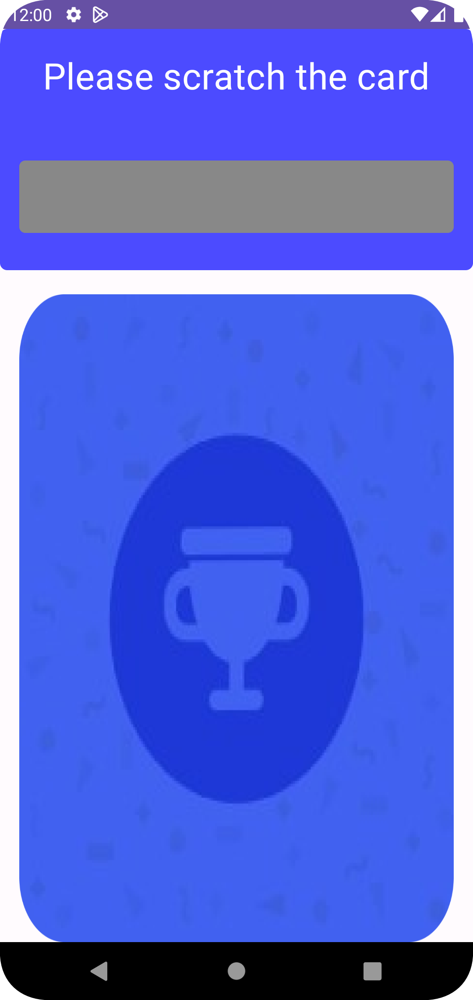
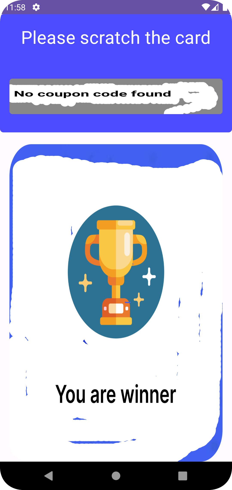

<h1 align="center">CardScratch</h1>

<p align="center">
  <a href="https://opensource.org/licenses/Apache-2.0"></a>
  </a>
  </a>
  </a>


CardScratching is an Android library that empowers app developers to integrate an interactive scratch card feature into their applications. With CardScratching, users can virtually 'scratch' a card on their device's screen, revealing concealed content underneath. This content is often used to showcase coupon codes, discounts, or other rewards, enhancing user engagement and creating an enjoyable interaction. The library offers customization options for the scratch card's appearance, making it easy to match the app's design. By leveraging CardScratching, developers can seamlessly introduce gamified elements to their apps, resulting in increased user interaction and satisfaction.

- **Interactive Scratching:** The library provides a touch-sensitive interface that simulates the act of scratching a surface to unveil hidden information.
- **Customizable Design:** Developers can customize the appearance of the scratch card, including its size, shape, colors, and text.
- **Revealing Content:** Underneath the scratched area, the library reveals content such as a coupon code, discount information, or any other rewards.
- **User Engagement:** The scratch card feature adds an element of gamification and user engagement to the application, encouraging users to interact with the app to reveal hidden rewards.
- **Integration:** The library can be integrated easily into existing Android apps, providing developers with a pre-built solution for adding scratch card functionality.


## Preview
 &nbsp;&nbsp;&nbsp;    


## Usage

### Dependency

#### Add the followings to your project level `build.gradle` file.

```groovy
dependencies {
  implementation 'com.github.JaberAhamed:CardScratch:1.0'
}
```

### Requirements

**1.** Minimum SDK for this library is **API 24**.

## License

```
Copyright 2021 JABER BIN AHAMED

Licensed under the Apache License, Version 2.0 (the "License");
you may not use this file except in compliance with the License.
You may obtain a copy of the License at

    http://www.apache.org/licenses/LICENSE-2.0

Unless required by applicable law or agreed to in writing, software
distributed under the License is distributed on an "AS IS" BASIS,
WITHOUT WARRANTIES OR CONDITIONS OF ANY KIND, either express or implied.
See the License for the specific language governing permissions and
limitations under the License.
```
